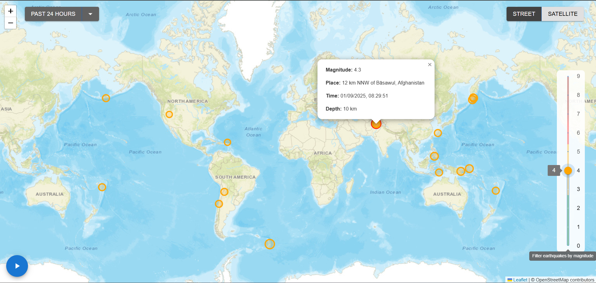
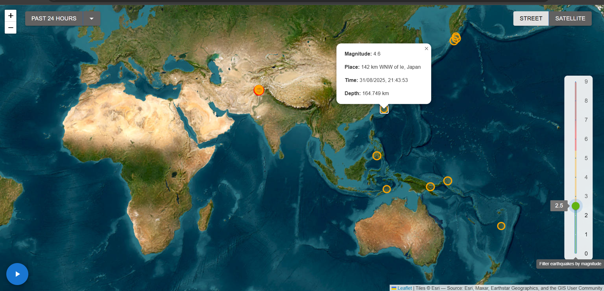

****Earthquake Visualizer****

An interactive React application that visualizes real-time earthquake data from the USGS Earthquake API on a world map.
The app provides filters, timeline animations, and map views (street/satellite) for exploring seismic activity.

***Features***

- Real-time Data: Fetches earthquake data live from the USGS API.

- Interactive Map: Visualizes earthquakes with dynamic markers sized and colored by magnitude.

- Magnitude Filtering: Adjust a slider to filter quakes by intensity.

- Timeline Filtering: View quakes from the past day, week, or month.

- Timeline Animation: Play an animated progression of earthquakes over time.

- Map View Toggle: Switch between street and satellite views.

***Tech Stack***

- Frontend: React.js

- UI Components: Material UI (MUI)

- Maps: React Leaflet + Leaflet.js

- Data Source: USGS Earthquake GeoJSON API

  ***Screenshots***
  
  
  
